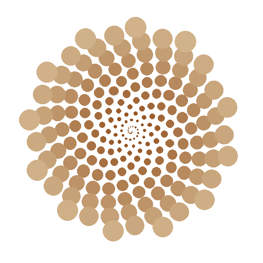

# ComfyUI-SnailShell 🐌 + Flip the Shell 🐚

<div align="center">
  
</div>

**ComfyUI-SnailShell** is a professional steganography suite for ComfyUI. It allows you to discreetly hide "Snails" (secret images or video sequences) inside an automatically generated "Shell" (a carrier image with a unique snail spiral pattern).

<div align="center">
  <a href="https://chromewebstore.google.com/detail/flip-the-shell/opplmeompodbeojbbccnllpbjhcbnnbn?hl=ko&utm_source=ext_sidebar" target="_blank" rel="noopener noreferrer">
    
  </a>
  &nbsp;
  <a href="https://www.runninghub.ai/?inviteCode=ux1wt2if" target="_blank" rel="noopener noreferrer">
    
  </a>
</div>

---

### 🚀 Optimized for RunningHub
<a href="https://www.runninghub.ai/?inviteCode=ux1wt2if" target="_blank" rel="noopener noreferrer">RunningHub</a> is the ultimate cloud platform for ComfyUI. **ComfyUI-SnailShell** is fully optimized for RunningHub, ensuring seamless dependency management and high-performance steganography directly in the cloud.

This project is perfectly integrated with the <a href="https://github.com/JKH-ML/flip-the-shell" target="_blank" rel="noopener noreferrer">Flip the Shell</a> Chrome extension, allowing users to verify hidden content directly in the browser.

## ✨ Key Features

- **🚀 Zero-Config Steganography**: Automatically determines the optimal bit-depth (2, 4, or 8 bits) and canvas size based on your data size.
- **🎬 Video Batch Support**: Directly hide a sequence of images (video frames). The node automatically compresses them into an MP4 and embeds them into the shell.
- **🔒 Password Protection**: Secure your hidden snails using high-standard SHA-256 encryption.
- **🖼️ Universal Format**: Works with single images (PNG) and video batches (MP4).
- **🌐 Web Integration**: Fully compatible with the **Flip the Shell** Chrome extension for instant decoding on any website.

---

## 🛠 Nodes Included

### 1. Snail in the Shell (Encoder)
- **Inputs**: 
  - `snail_image`: A single image to hide.
  - `snail_images`: A batch of images (video frames) to hide.
  - `password`: (Optional) Encryption key.
- **Output**: 
  - `shell_image`: The generated carrier image containing your hidden snail.

### 2. Flip the Shell (Decoder)
- **Inputs**: 
  - `shell_image`: The image containing a hidden snail.
  - `password`: (Required if encrypted) The key to unlock the snail.
- **Outputs**: 
  - `image`: The revealed single image (or the first frame of a video).
  - `images`: The full sequence of revealed frames (for video).
  - `status`: Decoding information and version logs.

---

## 🔍 Chrome Extension: Flip the Shell (Official Release)

The **Flip the Shell** companion extension is now available on the Chrome Web Store! It allows you to:
- **Real-time Detection**: Automatically scans for hidden data when hovering over images on any webpage.
- **Instant Extraction**: Reveal hidden images or videos in a high-quality overlay instantly.
- **Universal Support**: Works seamlessly across all websites, including RunningHub.

[**👉 Install Flip the Shell on Chrome Web Store**](https://chromewebstore.google.com/detail/flip-the-shell/opplmeompodbeojbbccnllpbjhcbnnbn?hl=ko&utm_source=ext_sidebar)

---

## 💻 Installation

1. Open your terminal and navigate to the ComfyUI `custom_nodes` folder:
   ```bash
   cd ComfyUI/custom_nodes
   ```
2. Clone this repository:
   ```bash
   git clone https://github.com/JKH-ML/ComfyUI-SnailShell.git
   ```
3. Install dependencies:
   ```bash
   pip install -r requirements.txt
   ```
4. Restart ComfyUI.

---

## 📜 Version History

### [v2.7] - 2026-03-26
- **Chrome Extension Support**: Fully integrated with the official "Flip the Shell" Chrome extension.
- **Workflow Optimization**: Enhanced performance for video batch processing.
- **Bug Fixes**: Improved stability for SHA-256 encryption/decryption.

## 📄 License
MIT License - Feel free to use and contribute!

---
**Maintained by <a href="https://github.com/JKH-ML" target="_blank" rel="noopener noreferrer">JKH-ML</a>**
